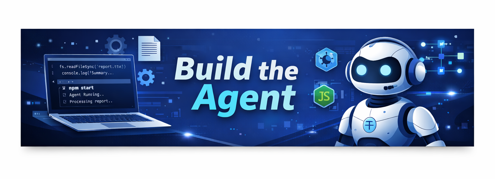
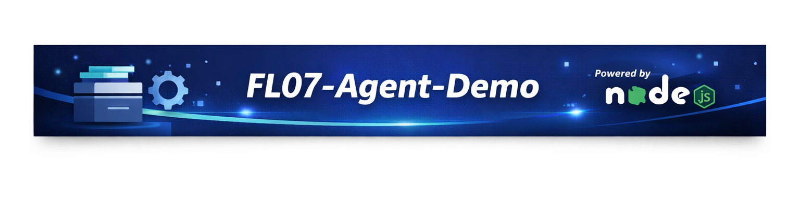

# Build the Agent Demo



---
A Node.js agent built for Assignment FL-07.  
This project demonstrates a minimal MCP filesystem connector that reads and summarizes a file (`report.txt`) end-to-end.

---

## 🚀 Features
- Summarizes the contents of a single file (`report.txt`).
- Uses Node.js `fs/promises` for filesystem access.
- Clean agent loop: request → tool → result.
- Output captured in a raw run recording (`raw-run.mp4`).

---

## 📂 Project Structure
 ```bash
fl07-agent-demo/
├── index.js          # Agent code
├── package.json      # Dependencies + module type
├── data/
│   └── report.txt    # Sample file to summarize
├── build-log.md      # Iteration notes
└── raw-run.mp4       # Screen recording of working run 
```

---

## 🎥 Raw Run Capture
The working run is available as:

Local file: raw-run.mp4

Public link: Google Drive Recording


---

## ✅ Deliverables
Agent code (index.js)

Build log (build-log.md)

Raw run capture (raw-run.mp4 / Drive link)

---

## 📜 License
This project is for educational/demo purposes under Assignment FL-07.

---



